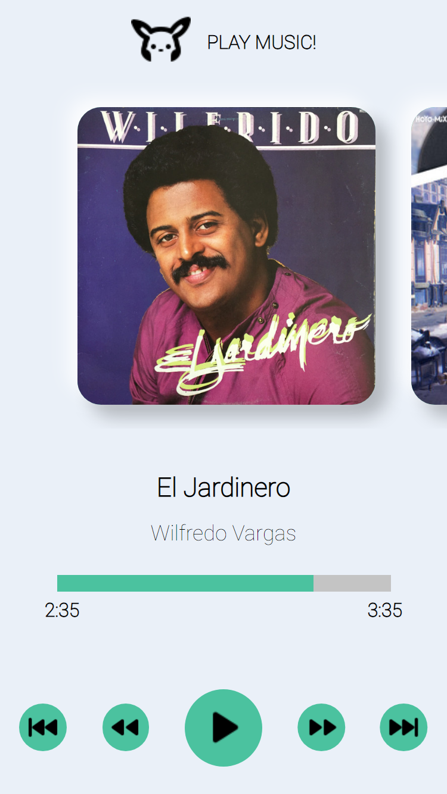
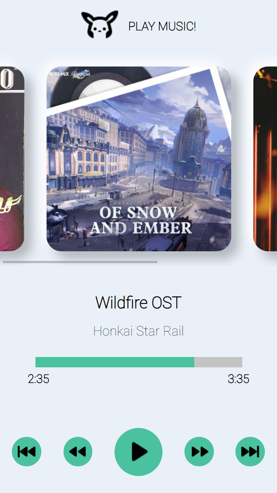

## Music Player!

Este proyecto inició con el fin de aplicar lo que aprendí del [Curso de Grid y Flexbox de Platzi](https://platzi.com/cursos/flexbox-css-grid/) de [@teffcode](https://github.com/teffcode)

## Design

## Herramientas

- HTML
- CSS
- React
- Webpack

## Estructura del proyecto

- **src**
  - **assets**: Contiene todo lo relacionado a imagenes, iconos y formato multimedia
  - **Components**: Contiene los elementos en su estructura minima del proyecto.
  - **Layout**: Son para los contenedores de los componentes
  - **Page**: Es la página del proyecto
  - **styles**: Contiene los estilos en general
- **.babelrc**: Configuración de cómo se debe transpilar el código fuente, qué plugins y presets de Babel se deben utilizar, así como otras opciones de configuración.
- **webpack.config.js**: Configuración del empaquetamiento de los diferentes archivos de la aplicación.
